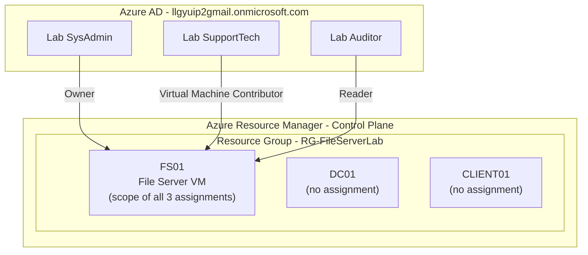
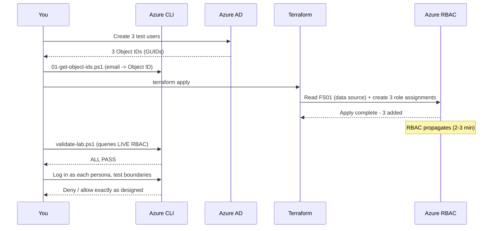
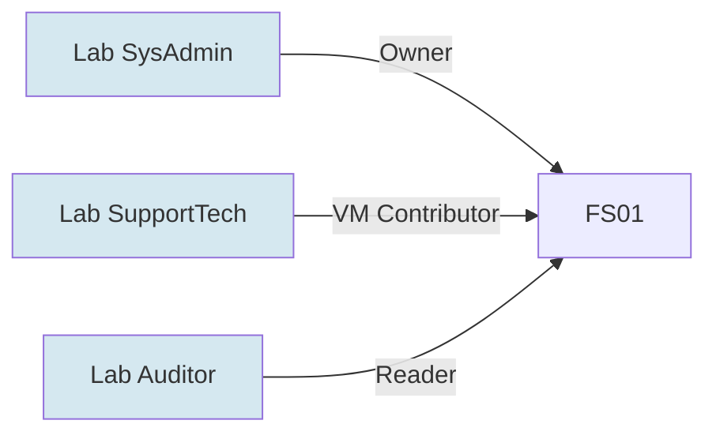
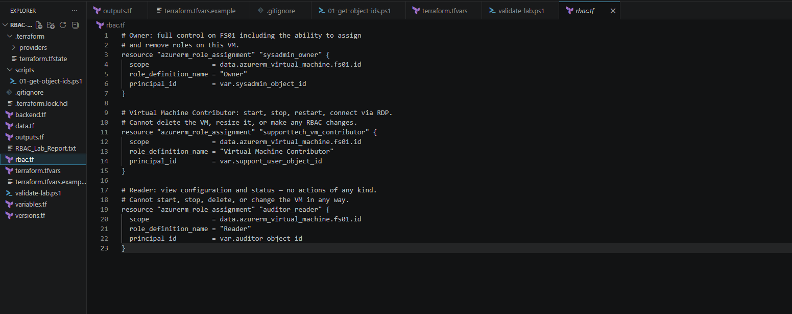
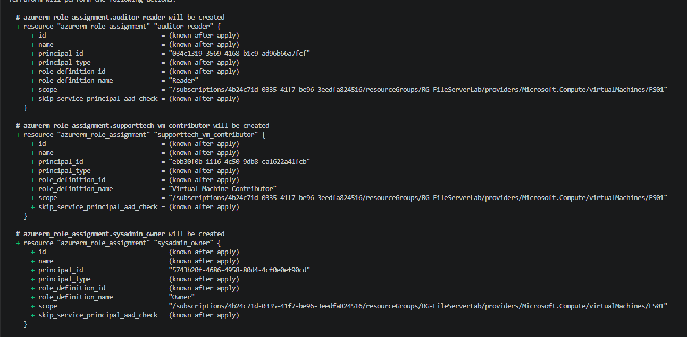
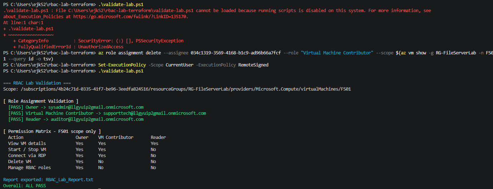
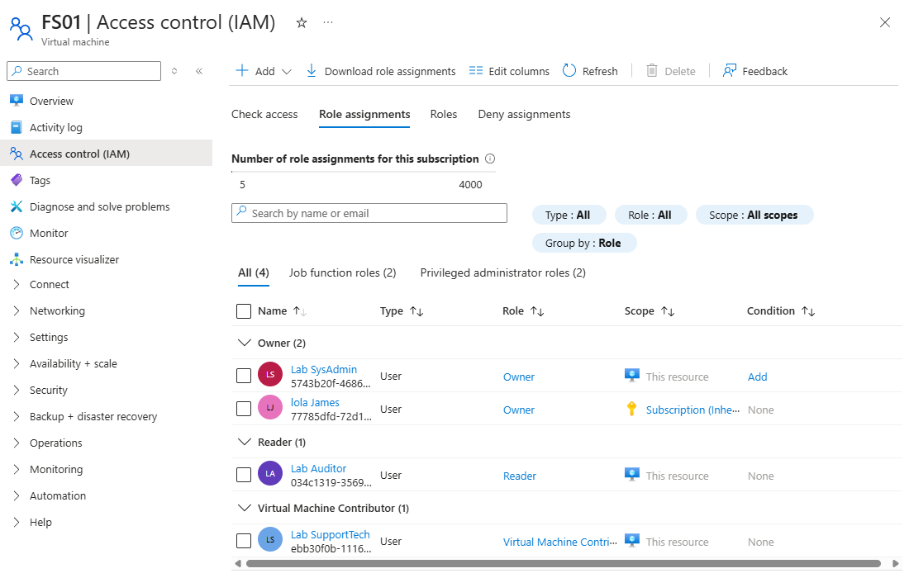
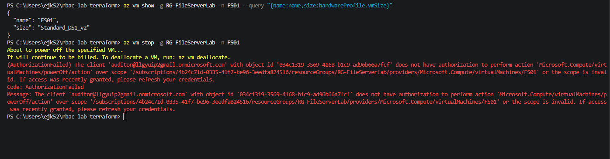
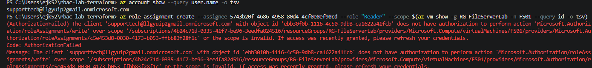
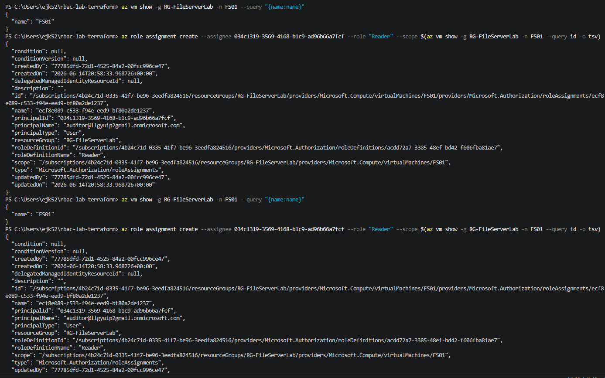

# Azure RBAC: Least-Privilege Access Control on a File Server

> A focused Azure Role-Based Access Control lab built with **Terraform** and validated with **PowerShell** and the **Azure CLI**. Three personas, three built-in roles, one virtual machine — scoped, deployed, and proven by logging in as each identity and watching the permission boundaries hold.

This project solves a problem every cloud environment faces: **controlling who can manage infrastructure, and to what degree.** It is the cloud control-plane counterpart to Lab 1 — where Lab 1 governed who could open files *inside* a server, this lab governs who can start, stop, delete, or reassign access to the server *itself*, from Azure.


Loom Link: https://www.loom.com/share/67ff3f4d1392464f8f7163dcbd0927de
---

## Table of Contents

1. [How This Fits With Lab 1](#how-this-fits-with-lab-1)
2. [What This Lab Demonstrates](#what-this-lab-demonstrates)
3. [Architecture](#architecture)
4. [The Access Model](#the-access-model)
5. [Technology Used](#technology-used)
6. [Repository Layout](#repository-layout)
7. [Infrastructure as Code](#infrastructure-as-code)
8. [Prerequisites](#prerequisites)
9. [How to Deploy](#how-to-deploy)
10. [Verification](#verification)
11. [Proving Enforcement — The Persona Tests](#proving-enforcement--the-persona-tests)
12. [Cost Management & Teardown](#cost-management--teardown)
13. [Troubleshooting & Lessons Learned](#troubleshooting--lessons-learned)
14. [Skills Demonstrated](#skills-demonstrated)

---

## How This Fits With Lab 1

Lab 2 deploys **no new infrastructure**. It reads Lab 1's existing FS01 virtual machine using Terraform data sources and layers three Azure role assignments on top of it. Understanding this relationship explains why the Terraform plan contains no VMs, and why this lab shares a storage account with Lab 1 but keeps its own state file.

| Lab | What it deploys | Relationship |
| --- | --- | --- |
| **Lab 1 — NTFS File Server** | DC01, FS01, CLIENT01, VNet, NSG, Key Vault in `RG-FileServerLab` | Standalone — builds all infrastructure from scratch |
| **Lab 2 — Azure RBAC** *(this lab)* | 3 role assignments on FS01 only — no new VMs | Depends on Lab 1 — reads Lab 1 resources via data sources, reuses Lab 1's storage account |

Both labs store remote state in the same Azure Storage container, separated only by key:

- Lab 1 → `ntfs-lab.terraform.tfstate`
- Lab 2 → `rbac-lab.terraform.tfstate`

Keeping the state keys separate is what guarantees a `terraform destroy` in this lab can never touch Lab 1's resources.

---

## What This Lab Demonstrates

In a real organization, different people need different levels of control over the same server:

- A **senior sysadmin** needs full control — start, stop, resize, delete, and manage who else has access.
- A **help desk technician** needs to restart an unresponsive server, but must never be able to delete it or change its security configuration.
- An **auditor** needs to view server details for compliance reporting but should never be able to take any action.

Azure RBAC enforces exactly this separation. Every action in Azure — starting a VM, reading its configuration, assigning a role — requires a specific permission, and RBAC grants each identity only what its job requires. This is the **principle of least privilege** applied at the cloud infrastructure level.

The lab builds that model end to end: three personas, three roles, one VM, fully scoped, tested, and validated against the live Azure control plane.

### RBAC vs. NTFS — two different walls

| | Lab 1 — NTFS | Lab 2 — RBAC |
| --- | --- | --- |
| **Governs** | Who can open/edit files *inside* the OS | Who can manage the *VM itself* from Azure |
| **Enforced by** | Windows file system ACLs | Azure Resource Manager control plane |
| **Example block** | Lisa can read but not write Finance files | Auditor can view but not stop FS01 |

A file server with flawless NTFS permissions but no RBAC control is still exposed — anyone with a portal login could stop or delete the entire VM without ever touching a file. Both walls are required.

---

## Architecture

Azure RBAC operates at the Resource Manager control plane, entirely separate from the NTFS permissions inside the VM. All three role assignments in this lab are scoped to **FS01's resource ID only**. DC01 and CLIENT01 sit in the same resource group but receive no assignments here — which is the entire point of scoping.



**Why scope to the VM and not the resource group:** the `scope` field on each role assignment is the single most important line in the project. Pointing it at FS01's resource ID means the role applies to that one VM and nothing else. Pointing it at the resource group ID would silently expand every role to DC01, CLIENT01, and any future resource in the group. Narrowest workable scope = smallest blast radius if an account is ever compromised.

### Deployment flow



---

## The Access Model

Access is granted to a **principal** (a user's immutable Azure AD Object ID), at a **scope** (FS01's resource ID), with a **role** (a named set of allowed actions). Three assignments encode the whole model.



### Expected permission matrix — FS01 scope only

| Action | Owner (SysAdmin) | VM Contributor (SupportTech) | Reader (Auditor) |
| --- | --- | --- | --- |
| View VM details | Yes | Yes | Yes |
| Start / Stop VM | Yes | Yes | **No** |
| Connect via RDP | Yes | Yes | **No** |
| Delete VM | Yes | **No** | **No** |
| Manage RBAC roles | Yes | **No** | **No** |

The roles nest cleanly: Reader can only look; VM Contributor can look **and** operate (start/stop/restart/connect) but cannot delete or touch access; Owner can do all of that **plus** manage who else has access. The persona tests below prove each boundary against the live platform.

> **A real-world nuance worth knowing:** VM Contributor can *read* role assignments (`roleAssignments/read`) but cannot *write* them (`roleAssignments/write`). "Can see who has access" is a different permission from "can change who has access." The persona tests demonstrate exactly this distinction.

---

## Technology Used

| Layer | Tool |
| --- | --- |
| Infrastructure as Code | Terraform (`azurerm` provider `~> 3.0`) |
| Cloud platform | Microsoft Azure |
| Identity | Azure AD (Entra ID) users and Object IDs |
| Validation & testing | PowerShell + Azure CLI |
| Remote state | Azure Blob Storage (shared with Lab 1, separate key) |

---

## Repository Layout

```
rbac-lab-terraform/
├── backend.tf                 # Remote state — reuses Lab 1 storage account, different key
├── versions.tf                # Terraform & provider version pins
├── variables.tf               # Inputs — 3 Object IDs with NO defaults (fail-loud safety)
├── data.tf                    # Reads Lab 1's RG and FS01 without modifying them
├── rbac.tf                    # The three role assignments, scoped to FS01
├── outputs.tf                 # VM ID, names, and (sensitive) role-assignment IDs
├── terraform.tfvars.example   # Safe template (committed)
├── terraform.tfvars           # Real Object IDs (git-ignored)
├── .gitignore                 # Blocks secrets, state, and the validation report
├── validate-lab.ps1           # Queries LIVE RBAC, prints matrix, exports report
├── scripts/
│   └── 01-get-object-ids.ps1  # Translates user emails to Azure AD Object IDs
└── Screenshots/               # Evidence captured during deployment & testing
```


*The Terraform files, the two PowerShell scripts, and `rbac.tf` open — showing all three role assignments scoped to `data.azurerm_virtual_machine.fs01.id`.*

---

## Infrastructure as Code

The entire access model is defined in code, so it can be reviewed, version-controlled, and rebuilt identically.

**`data.tf` — reads, never owns.** The conceptual heart of the lab. A `data` block looks up existing infrastructure without creating or modifying it. This is how Lab 2 references Lab 1's FS01 without taking ownership of it — and why `terraform destroy` here removes only the assignments, never the VM.

```hcl
data "azurerm_virtual_machine" "fs01" {
  name                = var.vm_name
  resource_group_name = data.azurerm_resource_group.lab.name
}
```

**`rbac.tf` — three assignments, one scope.** Each block answers three questions: *where* (scope), *what* (role), and *who* (principal).

```hcl
resource "azurerm_role_assignment" "supporttech_vm_contributor" {
  scope                = data.azurerm_virtual_machine.fs01.id  # FS01 only
  role_definition_name = "Virtual Machine Contributor"
  principal_id         = var.support_user_object_id
}
```

**`variables.tf` — fail-loud by design.** The three Object ID variables have **no default value**. If one is missing, Terraform stops and asks rather than silently assigning a powerful role to a placeholder. The resource group and VM names default to Lab 1's values and must match case-for-case.

> **Why Object IDs, not emails?** Every RBAC assignment requires the principal's Object ID — the immutable GUID for an identity in Azure AD. Email addresses can change; Object IDs never do. The `01-get-object-ids.ps1` script automates the email-to-GUID lookup.

> **Secrets stay out of source control.** `.gitignore` blocks `terraform.tfvars`, all state files, and the generated `RBAC_Lab_Report.txt`. Only `terraform.tfvars.example` — with placeholder values — is committed.

---

## Prerequisites

| Requirement | Notes |
| --- | --- |
| Lab 1 deployed | `RG-FileServerLab` and `FS01` must exist; FS01 should be running for the persona tests |
| Terraform ≥ 1.5.0 | `terraform -version` |
| Azure CLI | `az version` |
| Three Azure AD test users | Members of your tenant (not external/Gmail identities) — these receive the three roles |
| Permission to create users & assign roles | An Owner or User Access Administrator on the subscription |

Confirm Lab 1 is up before starting:

```powershell
az vm list -d -g RG-FileServerLab --query "[].{name:name,status:powerState}" -o table
# All three VMs should show: VM running
```

---

## How to Deploy

### 1. Create three test users in your tenant

Replace the domain with your own (find it via `az ad signed-in-user show --query userPrincipalName -o tsv`). Each command returns the user's `id` — that is the Object ID you need.

```powershell
az ad user create --display-name "Lab SysAdmin"     --user-principal-name sysadmin@YOURTENANT.onmicrosoft.com    --password "<StrongP@ss1>" --force-change-password-next-sign-in false
az ad user create --display-name "Lab SupportTech"  --user-principal-name supporttech@YOURTENANT.onmicrosoft.com --password "<StrongP@ss2>" --force-change-password-next-sign-in false
az ad user create --display-name "Lab Auditor"      --user-principal-name auditor@YOURTENANT.onmicrosoft.com     --password "<StrongP@ss3>" --force-change-password-next-sign-in false
```

### 2. Configure the backend and variables

In `backend.tf`, set `storage_account_name` to your Lab 1 storage account. The `key` stays `rbac-lab.terraform.tfstate`.

Copy the template and fill in the three Object IDs:

```powershell
Copy-Item terraform.tfvars.example terraform.tfvars
# Paste the three Object IDs into terraform.tfvars
# Confirm resource_group_name = "RG-FileServerLab" and vm_name = "FS01" match Lab 1 exactly
```

### 3. Deploy

```powershell
az login
terraform init
terraform plan     # Must show exactly 3 resources — no VMs, no networking
terraform apply    # Type yes — completes in under a minute
```


*The plan: three `azurerm_role_assignment` resources, each with a `scope` ending in `/virtualMachines/FS01`. Exactly three resources, nothing else — confirming the VM-level scoping is correct.*

> **If the plan shows more than 3 resources, stop.** It means `resource_group_name` or `vm_name` does not match Lab 1 case-for-case. `FS01` is not the same as `fs01`.

---

## Verification

`terraform apply` confirms Terraform *created the assignment objects*. It does **not** confirm Azure *propagated the permissions* — those are two different systems, and RBAC propagation can take 2–10 minutes. The `validate-lab.ps1` script ignores Terraform entirely and queries the **live** RBAC state on FS01, then exports an auditable report.

```powershell
# Wait 2-3 minutes after apply, then:
.\validate-lab.ps1
```


*All three role assignments confirmed live on FS01, mapped to the correct personas, with the permission matrix and an `Overall: ALL PASS` verdict. The run also exports `RBAC_Lab_Report.txt` as a structured compliance artifact.*

The assignments are also visible in the portal — FS01 → Access control (IAM) → Role assignments:


*SysAdmin (Owner), Auditor (Reader), and SupportTech (Virtual Machine Contributor), each scoped to "This resource" — FS01 — not the subscription or resource group.*

---

## Proving Enforcement — The Persona Tests

Automated validation confirms the assignments exist. The persona tests prove they are **enforced**: logging in as each user and attempting actions the role should and should not permit. Each `AuthorizationFailed` is a success — it is least privilege working exactly as designed.

### Auditor (Reader) — can view, cannot act


*`az vm show` **succeeds** — Reader can view configuration. `az vm stop` **fails** with `AuthorizationFailed` on `Microsoft.Compute/virtualMachines/powerOff/action`. The error names the exact identity, action, and scope that was denied.*

### SupportTech (VM Contributor) — can operate, cannot manage access

```powershell
az vm start -g RG-FileServerLab -n FS01     # SUCCEEDS — can operate the VM
az role assignment create --assignee <id> --role "Reader" --scope <fs01-id>   # FAILS
```


*SupportTech can start the VM, but creating a role assignment **fails** with `AuthorizationFailed` on `Microsoft.Authorization/roleAssignments/write`. SupportTech can manage VM availability — but not who has access to it.*

### SysAdmin (Owner) — full control, including access management


*The same `az role assignment create` action that was denied to SupportTech **succeeds** for the Owner — note `updatedBy` is the SysAdmin's Object ID. Identical command, opposite result, because Owner holds the `roleAssignments/write` permission VM Contributor lacks.*

### Result summary

| Action attempted | Auditor (Reader) | SupportTech (VM Contributor) | SysAdmin (Owner) |
| --- | --- | --- | --- |
| View VM details | ✅ Succeeded | ✅ Succeeded | ✅ Succeeded |
| Start / Stop VM | ❌ Denied | ✅ Succeeded | ✅ Succeeded |
| Read RBAC assignments | — | ✅ Succeeded | ✅ Succeeded |
| **Write RBAC assignments** | — | ❌ **Denied** | ✅ **Succeeded** |

Every result matches the [expected matrix](#expected-permission-matrix--fs01-scope-only), confirming least privilege is enforced at the individual-action level across three real identities.

---

## Cost Management & Teardown

Role assignments are **free** — only Lab 1's VMs incur compute charges. To stop charges while keeping everything intact:

```powershell
az vm deallocate --ids $(az vm list -g RG-FileServerLab --query "[].id" -o tsv)
```

**Option A — remove RBAC only, keep Lab 1:**

```powershell
terraform destroy   # Removes the 3 assignments; Lab 1 is untouched (it was only read, never owned)
```

**Option B — full teardown of both labs:**

```powershell
terraform destroy                                    # Remove RBAC first
az group delete -n RG-FileServerLab --yes --no-wait  # Remove all Lab 1 resources
```

---

## Troubleshooting & Lessons Learned

Every issue below was encountered and resolved during this build. Each is a condition a cloud administrator routinely meets.

| Problem encountered | Root cause | Resolution |
| --- | --- | --- |
| `That Microsoft account doesn't exist` at sign-in | The browser tried to authenticate a **work/school** account through the **personal** Microsoft account flow | Used `az login --use-device-code`, which correctly handles organizational accounts |
| `Let's keep your account secure` (MFA prompt) | Tenant enforced MFA registration on first sign-in for the new test users | Registered Microsoft Authenticator per account — the intended secure path |
| `validate-lab.ps1` / script **cannot be loaded** | PowerShell execution policy blocked local scripts | `Set-ExecutionPolicy -Scope CurrentUser -ExecutionPolicy RemoteSigned` (user-scoped, no admin needed) |
| PowerShell **parser errors** on the scripts | Backtick-escaped quotes (`` `" ``) were corrupted on copy-paste | Rewrote the print logic using the `-f` format operator with single-quoted format strings — no fragile escaping |
| SupportTech could **read** RBAC assignments (unexpected) | VM Contributor includes `roleAssignments/read`; only `write`/`delete` are withheld | Re-tested the boundary with `role assignment create`, which correctly **denied** on `roleAssignments/write` |
| A manual test assignment caused **state drift** | Granting a role via CLI created an assignment Terraform didn't track | Removed it with `az role assignment delete`, then re-ran `validate-lab.ps1` to confirm the model matched the code again |

**Takeaway:** the most valuable lessons came from the gaps between *expectation* and *platform reality* — chiefly that RBAC permissions are per-action (read vs. write are distinct), and that creating real `AuthorizationFailed` denials is the only way to *prove* least privilege rather than assume it.

---

## Skills Demonstrated

- **Azure RBAC** — built-in roles, principals, scopes, and the least-privilege model at the control plane
- **Scoping discipline** — assigning roles to a single resource ID to minimize blast radius
- **Infrastructure as Code** — Terraform data sources to reference existing infrastructure without owning it; remote state with isolated keys
- **Azure AD / Entra ID** — creating users, resolving Object IDs, the email-vs-GUID distinction
- **Enforcement testing** — login-as-user verification with the Azure CLI to prove, not assume, access boundaries
- **Compliance reporting** — automated, exportable validation against live platform state
- **Troubleshooting** — authentication flows, MFA, execution policy, and reconciling state drift

---

*Lab 2 of a series. Built on the FS01 file server from [Lab 1 — Active Directory File Server with NTFS Permissions]([https://github.com/ejk52515](https://github.com/ejk52515/azure-ntfs-fileserver-lab).*
